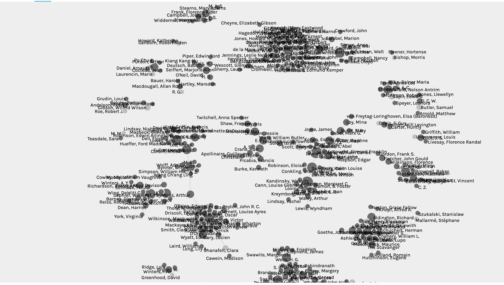
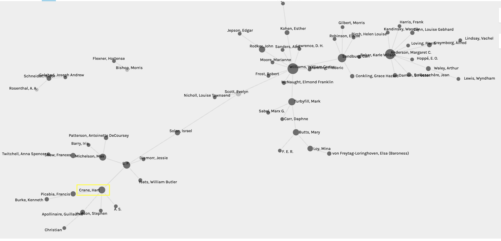

For this assignment, I used Melanie Walsh's Modernist Journal Project repository of authors published in *Poetry* and *The Little Review*.

I could not figure out how to upload data into Gephi-lite. It seemed like the file format needs to be a GEXF file, and I don't know what that is or how to convert a .csv file into that. I was able to figure out how to upload data in Palladio and Network Navigator. I felt like it would be beneficial to have some kind of direction in order to explore the network visualizations and metrics produced in Palladio and Network Navigator, so I arbitrarily decided to focus on the poet Hart Crane (because I like him). In spite of having a bit of direction, I still didn't feel like I was making heads or tails of the metrics.

Here is my full network visualization in Palladio:

Here is my network visualization in Palladio zooming in on Hart Crane:

Here is my network visualization in Palladio with Hart Crane as the "facet" (which I think is kind of like a filter?)

It seems like you can more easily export visualizations and metrics from Network Navigator. I felt like I was not fully utilizing the functions in Palladio.